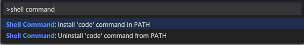

# Mac Terminal Config

Mac Terminal Eye Candy Terminal Mods

This guide is based on a video created by the Typecraft YouTube channel. It attempts to be a bit more specific about the steps for those who are just starting out on the command line.

## iTerm2

### Installation:

```
brew install --cask iterm2
```

Confirm your default shell is zsh

```
echo $0
```

You should get a response that shows `-zsh` If you have some other default shell, change it to zsh by entering the following command:

```
chsh -s $(which zsh)
```

### Install a color scheme

- Go to <https://iterm2colorschemes.com> and choose a color scheme
- In the terminal, go to your home folder ~/ and create a file named gruvbox.itermcolors

```
cd ~/
touch gruvbox.itermcolors
```

- Open the newly created gruvbox.itermcolors file in your favorite editor. In this example, we will use VS Code

```
code ~/gruvbox.itermcolors
```

- If VSCode does not launch, you may need to configure VSCode to launch from the command line. [Follow this link to the VS Code from command line section below.](#Launching-VS-Code-from-the-command-line) Return here once you have completed those steps and you are able to launch VS Code by typing code in any terminal session.

- Ensure you have started your code editor by running the command below:

```
code ~/gruvbox.itermcolors
```

- Paste in the xml code from the color scheme you chose on <https://iterm2.colorschemes.com> and then save and close the file.

### Enable the new color scheme

- In iTerm2, open Settings and choose the Profiles icon at the top of the dialog box.
- Choose the Colors tab
- Click the Color Presets drop-down in the lower right corner
- Choose Import
- Go to your home folder and choose the gruvbox.itermcolors file you created.
- Click the Color Presets drop-down again. You should now see Gruvbox in the list. Choose Gruvbox to change to your new color scheme. If you do not like the color scheme you chose, try again or take a look at the Smooooooth preset.

## oh-my-zsh (oh my z-shell)

### Installation:

- Run the following command to download and install oh-my-zsh

```
sh -c "$(curl -fsSL https://raw.githubusercontent.com/ohmyzsh/ohmyzsh/master/tools/install.sh)"
```

### Add fonts to show icons in certain places

- Go to <https://nerdfonts.com>
- Click the Downloads button
- I’m currently using Hack Nerd Font, 3270 Nerd Font is cool as well. Find something you lik and click Download.
- Unzip the file that you just downloaded and then go to the folder that was created after you unziped the file.
- Look through the fonts in the newly created folder. You should see some fonts that have the word mono in the name. Typically you want to choose the file that has mono and regular or normal in the name. These are typically designed for the terminal. You can click on each to see a preview next to the file. Once you find the correct fil, double click the file. You should see a dialog box load from Font Book that shows your new font with the option to click Install in the lower right corner. Click the Install button. Close the Font Book app once the font is installed.
- Open iterm2 and choose Settings. In the Settings dialog box, choose Profiles and then select the Text tab.
- In the Text tab, choose the Font dropdown and find your newly installed font.

## Powerlevel10k

### Installation

Enter the following on the command line to install Powerlevel10k

```
brew install powerlevel10k
echo "source $(brew --prefix)/share/powerlevel10k/powerlevel10k.zsh-theme" >>~/.zshrc
```

### p10k configure

- Open your .zshrc file located in your home folder ~/.zshrc
- Update the zsh theme variable to ZSH_THEME= “powerlevel10k/powerlevel10k”
- Save and close the file
- Enter the following command line to start the Powerlevel10k config wizard:

```
  source ~/.zshrc
```

## Color LS

### Installation

- Run the following command to install Color LS

```
sudo gem install colorls
```

### Configure Color LS

- Add an alias to your .zshrc file so we don't have to type colorls every time.

```
code ~/.zshrc
```

- Add the following line to the bottom of your ~/.zshrc file

```
alias ls='colorls'
```

- Enter the following command to load the new settings from ~/.zshrc

```
source ~/.zshrc
```

## Launching VS Code from the command line

- Launch VS Code

  - Open the Command Palette (Cmd+Shift+P) and type `'shell command'` to find the **Shell Command: Install 'code' command in PATH command.**

  

  - Restart the iTerm2 for the new $PATH value to take effect. You'll be able to type `` `code` `` in any folder to start editing files in that folder.
